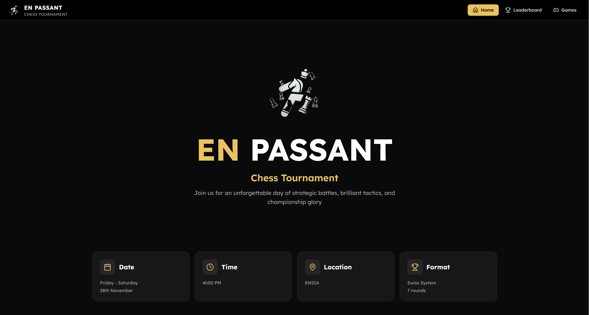

<h1 style="font-family: Arial, sans-serif; font-size: 36px; color: #EAC360; display: flex; align-items: center; gap: 12px; border-bottom: 3px solid #EAC360; padding-bottom: 8px;">
    
    En Passant - Chess Tournament Platform
</h1>

A modern, fast, and responsive web platform for the **EN PASSANT Chess Tournament**.
Built to present tournament information, live standings, round-by-round games, and an admin dashboard for managing players and matches.


> [!NOTE]
> The competition is over and the production backend was closed. This repository is now kept as a lightweight frontend/archive of the tournament platform.

---

## Tech Used


---

## Features

- Tournament landing page with event details and rules
- Live leaderboard sorted by score, Buchholz, and rating
- Games page grouped by rounds with match results
- Admin dashboard for players, games, and round controls
- Authentication flow with protected admin routes
- Responsive UI with reusable components

---

## How It Works (Matching System)

The tournament logic follows a Swiss-style system implemented in `src/server/games.ts`, `src/server/results.ts`, and `src/server/leaderboard.ts`.

1. Player eligibility

- A player is included for pairing only if `is_active = true` and `is_present = true`.
- Pairing starts only when at least 2 eligible players exist.

2. Sort and bracket creation

- Players are sorted by:
  1) `score` (desc),
  2) `buchholz` (desc),
  3) `rating` (desc).
- Score brackets are formed so players with equal score are grouped together.

3. Pairing inside brackets

- A backtracking search tries legal pairs in each bracket.
- Candidate quality uses a penalty function:
  - rating difference penalty (`abs(diff) / 100`),
  - huge penalty for color incompatibility,
  - huge penalty for rematches (effectively forbidden),
  - minor preference tuning for color constraints.
- If a bracket cannot be fully paired, the lowest-rated unpaired player is downfloated to the next bracket.

4. Color assignment and balancing

- Each player has a `color` streak:
  - `+1` / `+2`: recent White preference / forced Black next,
  - `-1` / `-2`: recent Black preference / forced White next,
  - `0`: neutral.
- `assignMatchColors` enforces forced constraints first, then preferences, then resolves ties by streak pressure, rating, then ID.
- This avoids repeated same-color runs and keeps color distribution fair over rounds.

5. Bye handling

- If the eligible player count is odd, one bye is assigned.
- Bye selection favors:
  - fewest prior byes first,
  - then lowest rating.
- Bye games are stored as `black = 0` and `presence = 1`.

6. Round lifecycle

- `generateScheduledRound()` creates all games as `PENDING` for the next round.
- `startScheduledRound()` validates the current round is still fully pending.
- Results are applied through `updateGameResult()`:
  - first result entry adds opponents, games count, and color streak updates,
  - changing a result first undoes old stats, then applies new stats,
  - stats tracked: wins, draws, losses, byes, games.

7. Leaderboard and tie-breaks

- Final score is computed as:
  - `wins + byes + 0.5 * draws`.
- Buchholz is computed as the sum of all opponents' scores.
- Display order is score -> Buchholz -> rating.

---

## Screenshots

<br>


**Home:** Tournament hero, schedule, and rules.

---

## Project Structure

```plaintext
src/
|-- app/                    # App Router pages and API routes
|   |-- dashboard/
|   |-- games/
|   |-- leaderboard/
|   |-- login/
|   |-- logout/
|   |-- signup/
|   `-- api/auth/
|-- components/             # Shared UI + feature components
|   |-- auth/
|   |-- dashboard/
|   `-- ui/
|-- hooks/                  # Client-side logic hooks
|-- layout/                 # Navbar and Footer
|-- lib/supabase/           # Supabase client/server/middleware helpers
|-- server/                 # Tournament server actions and logic
|-- style/                  # Global/theme utility styles
`-- types/                  # Type definitions
```

---

## Getting Started

1. Install dependencies

```bash
pnpm install
```

2. Create `.env.local` (or use `.env` in local dev) with:

```env
NEXT_PUBLIC_SUPABASE_URL=your_supabase_url
NEXT_PUBLIC_SUPABASE_ANON_KEY=your_supabase_anon_key
NEXT_PUBLIC_ALLOWED_EMAILS=admin1@example.com,admin2@example.com
```

3. Start development server

```bash
pnpm dev
```

4. Open in browser

```text
http://localhost:3000
```

---

## Available Scripts

```bash
pnpm dev      # Run development server
pnpm build    # Build for production
pnpm start    # Start app (currently runs next dev in this project)
pnpm lint     # Run ESLint
```

---

## Routes

- `/` -> Landing page and tournament rules
- `/leaderboard` -> Live ranking table
- `/games` -> Round-by-round matches
- `/dashboard` -> Admin panel (protected)
- `/login` -> Sign in
- `/signup` -> Sign up
- `/logout` -> Sign out
- `/api/auth/set-session` -> Persist auth session
- `/api/auth/sign-out` -> Clear auth session

---

## Environment Notes

- The dashboard is protected by middleware.
- Only emails listed in `NEXT_PUBLIC_ALLOWED_EMAILS` can access `/dashboard`.
- Supabase session cookies are refreshed via middleware and API auth routes.
- For current archive usage, backend-powered features may not be available unless you reconnect valid Supabase credentials.

---

## Credits

Developed for **EN PASSANT Chess Tournament**

By: **ESCC Dev Team**
